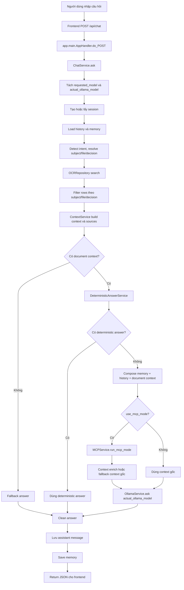
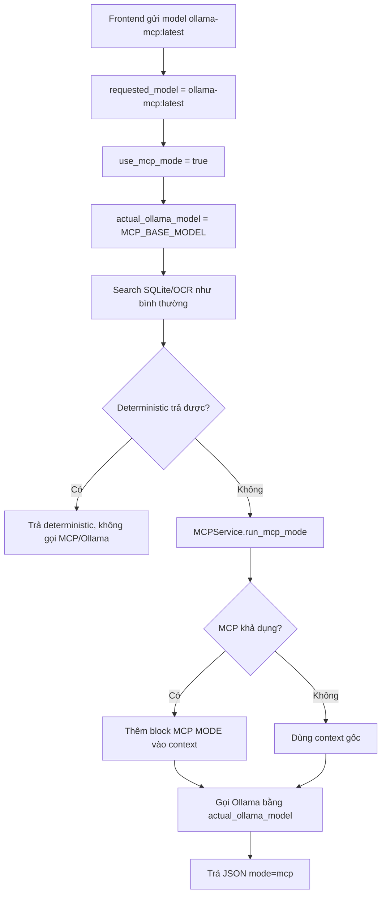

# Phân tích luồng xử lý chatbot AHLLVT

## 1. Tổng quan đồ án

Đồ án xây dựng chatbot tra cứu hồ sơ Anh hùng Lực lượng vũ trang nhân dân tỉnh Long An. Backend chạy bằng Python `ThreadingHTTPServer`, frontend là một file HTML tĩnh ở `static/chatbot.html`, dữ liệu nghiệp vụ chính nằm trong SQLite `data/ocr_qa.db`.

Người dùng đặt câu hỏi trên giao diện web. Frontend gửi request đến `POST /api/chat`. Backend tìm dữ liệu OCR/SQLite, tạo ngữ cảnh tài liệu, ưu tiên trả lời bằng rule deterministic nếu câu hỏi thuộc dạng chắc chắn, sau đó mới gọi Ollama khi cần sinh câu trả lời từ context.

Nguồn chứng cứ chính của chatbot là SQLite/OCR. Memory chỉ dùng để hiểu câu hỏi nối tiếp. MCP mode là chế độ tùy chọn thông qua model ảo `ollama-mcp:latest`; đây không phải model Ollama thật.

Các thành phần chính:

| Thành phần | File/thư mục | Vai trò |
|---|---|---|
| Frontend | `static/chatbot.html` | Giao diện chat, sidebar session, chọn model |
| HTTP server | `app/main.py` | Serve static file và API |
| Điều phối hỏi đáp | `app/services/chat_service.py` | Luồng chính của chatbot |
| OCR repository | `app/repositories/ocr_repo.py` | Tìm kiếm dữ liệu OCR/SQLite |
| Context service | `app/services/context_service.py` | Build document context và sources |
| Deterministic answer | `app/services/deterministic_answer_service.py` | Trả lời rule-based trước Ollama |
| Ollama service | `app/services/ollama_service.py` | Gọi `legacy_backend.call_local_llama` |
| MCP service | `app/services/mcp_service.py` | MCP status và MCP context enrichment an toàn |
| Memory service | `app/services/memory_service.py` | Load/save memory và resolve câu hỏi nối tiếp |
| Dữ liệu OCR | `data/ocr_qa.db`, `data/ocr_qa.sql` | Nguồn dữ liệu tra cứu |
| Memory runtime | `data/memory.db` | Lưu trí nhớ hội thoại theo session |

## 2. Cấu trúc thư mục chính

```text
chatbot_AHLLTVT/
├── app/
│   ├── main.py
│   ├── config.py
│   ├── database.py
│   ├── legacy_backend.py
│   ├── models/
│   │   └── schemas.py
│   ├── repositories/
│   │   ├── chat_history_repo.py
│   │   ├── memory_repo.py
│   │   └── ocr_repo.py
│   ├── services/
│   │   ├── chat_service.py
│   │   ├── context_service.py
│   │   ├── deterministic_answer_service.py
│   │   ├── mcp_service.py
│   │   ├── memory_service.py
│   │   └── ollama_service.py
│   └── utils/
│       ├── extract_utils.py
│       ├── format_utils.py
│       └── text_utils.py
├── static/
│   └── chatbot.html
├── data/
│   ├── ocr_qa.db
│   ├── ocr_qa.sql
│   └── memory.db
├── docs/
│   └── PHAN_TICH_LUONG_XU_LY_CHATBOT.md
├── tests/
│   └── test_chatbot_backend.py
├── Adaptive-Graph-of-Thoughts-MCP-server/
├── Memori-main/
├── run.py
├── chatbot_server.py
├── demo_terminal_qa.py
├── requirements.txt
├── requirements-mcp.txt
└── run_mcp.ps1
```

## 3. Cấu hình runtime

File cấu hình chính: `app/config.py`.

| Biến | Mặc định | Ý nghĩa |
|---|---|---|
| `CHATBOT_HOST` | `127.0.0.1` | Host HTTP server |
| `CHATBOT_PORT` | `8000` | Port HTTP server |
| `OLLAMA_MODEL` | `llama3:latest` | Model mặc định nếu request không gửi model |
| `VIRTUAL_MCP_MODEL` | `ollama-mcp:latest` | Model ảo để bật MCP mode trong chatbot |
| `MCP_BASE_MODEL` | `llama3:latest` | Model Ollama thật dùng khi chọn `ollama-mcp:latest` |
| `CHATBOT_ENABLE_MCP` | `0` | Cho phép MCPService probe/import MCP stack |
| `CHATBOT_ENABLE_MEMORY` | `1` | Bật/tắt memory service |
| `OCR_QA_DB` | `data/ocr_qa.db` | Đường dẫn DB OCR |
| `CHATBOT_MEMORY_DB` | `data/memory.db` | Đường dẫn DB memory |

Điểm quan trọng:

- `ollama-mcp:latest` không được gửi trực tiếp vào Ollama.
- Nếu người dùng chọn `ollama-mcp:latest`, backend vẫn gọi Ollama bằng `MCP_BASE_MODEL`.
- Nếu không set `MCP_BASE_MODEL`, model thật là `llama3:latest`.

## 4. Model và chế độ trả lời

Frontend có dropdown model trong `static/chatbot.html`:

| Model hiển thị | Ý nghĩa | Model gửi tới Ollama |
|---|---|---|
| `llama3:latest` | Chế độ bình thường | `llama3:latest` |
| `qwen2.5:latest` | Chế độ bình thường nếu máy có model | `qwen2.5:latest` |
| `mistral:latest` | Chế độ bình thường nếu máy có model | `mistral:latest` |
| `ollama-mcp:latest` | Model ảo để bật MCP mode | `MCP_BASE_MODEL`, mặc định `llama3:latest` |

Trong `ChatService.ask`, backend tách rõ:

```python
requested_model = model người dùng chọn
use_mcp_mode = requested_model == "ollama-mcp:latest"
actual_ollama_model = MCP_BASE_MODEL nếu use_mcp_mode, ngược lại requested_model
```

Toàn bộ chỗ gọi `OllamaService.ask` dùng `actual_ollama_model`.

## 5. Luồng tổng quát từ frontend đến backend

1. Người dùng nhập câu hỏi trong `static/chatbot.html`.
2. Frontend gọi `POST /api/chat`.
3. Request body gồm `question`, `session_id`, `model`.
4. `app/main.py` đọc JSON, kiểm tra câu hỏi rỗng.
5. `AppHandler.do_POST` gọi `ChatService().ask(question, model, session_id)`.
6. `ChatService` xử lý session, memory, intent, OCR search, context, deterministic answer, MCP mode nếu có, Ollama nếu cần.
7. Backend trả JSON về frontend.
8. Frontend render câu trả lời.

Response `/api/chat` hiện trả thêm metadata:

```json
{
  "answer": "...",
  "session_id": "...",
  "sources": [],
  "requested_model": "ollama-mcp:latest",
  "actual_model": "llama3:latest",
  "mode": "mcp",
  "mcp_used": false,
  "tools_used": []
}
```

Frontend hiện chỉ cần `answer` và `session_id`, các field metadata không làm vỡ giao diện.

## 6. Luồng chính trong ChatService

File: `app/services/chat_service.py`.

Thứ tự xử lý hiện tại:

1. Nhận `question`, `model`, `session_id`.
2. Tách `requested_model`, `use_mcp_mode`, `actual_ollama_model`.
3. Tạo hoặc lấy session.
4. Cập nhật title session từ câu hỏi.
5. Load lịch sử trước đó.
6. Detect intent câu hỏi.
7. Load memory context.
8. Trích số hồ sơ, số quyết định, chủ thể đang hỏi.
9. Xử lý các nhánh đặc biệt như `follow_up_expand`, `context_correction`, `decision_people_lookup`.
10. Lưu user message.
11. Load history mới.
12. Resolve search question bằng memory nếu cần.
13. Gọi OCR repository:
    - `search_by_file_number` nếu có số hồ sơ cụ thể.
    - `search_by_decision_number` nếu có số quyết định cụ thể.
    - `search` cho tìm kiếm tổng quát.
14. Filter rows theo chủ thể, số hồ sơ, số quyết định.
15. Build `document_context`.
16. Build `sources`.
17. Nếu không có context, trả fallback theo intent.
18. Nếu có context, gọi `DeterministicAnswerService.answer`.
19. Nếu deterministic trả được, dùng luôn câu trả lời đó.
20. Nếu deterministic không trả được, compose context gồm intent, memory, history, document context.
21. Nếu `use_mcp_mode = true`, gọi `MCPService.run_mcp_mode`.
22. Gọi `OllamaService.ask` bằng `actual_ollama_model`.
23. Clean answer theo intent.
24. Lưu assistant message.
25. Save memory.
26. Trả `ChatResult` gồm answer, sources và metadata model/MCP.

Điểm ưu tiên quan trọng:

- Deterministic answer luôn chạy trước MCP/Ollama.
- MCP mode chỉ chạy khi chọn `ollama-mcp:latest`.
- Ollama không bao giờ nhận model `ollama-mcp:latest`.
- Nếu MCP lỗi hoặc không khả dụng, context gốc vẫn được dùng.

## 7. Sơ đồ luồng xử lý

### Luồng tổng quát



### Luồng chọn `ollama-mcp:latest`



## 8. API endpoints

| Method | URL | Vai trò |
|---|---|---|
| `GET` | `/` | Redirect/serve `chatbot.html` |
| `GET` | `/chatbot.html` | Giao diện chatbot |
| `GET` | `/api/sessions` | List session |
| `POST` | `/api/sessions` | Tạo session mới |
| `GET` | `/api/sessions/{session_id}/messages` | Load messages |
| `DELETE` | `/api/sessions/{session_id}` | Xóa session và memory liên quan |
| `DELETE` | `/api/sessions` | Xóa toàn bộ session và memory |
| `GET` | `/api/sessions/{session_id}/memory` | Xem memory của session |
| `DELETE` | `/api/sessions/{session_id}/memory` | Xóa memory của session |
| `GET` | `/api/memory/status` | Kiểm tra memory |
| `GET` | `/api/mcp/status` | Kiểm tra MCP |
| `POST` | `/api/chat` | Hỏi đáp chính |
| `POST` | `/chat` | Alias tương thích |
| `POST` | `/ask` | Alias tương thích |

Request mẫu:

```json
{
  "question": "Tổng trợ cấp được cấp cho Cao Thị Mai là bao nhiêu?",
  "session_id": null,
  "model": "ollama-mcp:latest"
}
```

Response mẫu:

```json
{
  "answer": "Tổng trợ cấp được cấp cho Cao Thị Mai là 900.000 đồng...",
  "session_id": "uuid-session",
  "sources": [
    {
      "source_table": "raw_pages",
      "source_id": 97,
      "page_no": 97,
      "title": "Trang OCR 97",
      "record_number": "LA/08",
      "decision_number": "08/LĐTBXH.BC",
      "issued_date": "20/04/2006"
    }
  ],
  "requested_model": "ollama-mcp:latest",
  "actual_model": "llama3:latest",
  "mode": "mcp",
  "mcp_used": false,
  "tools_used": []
}
```

## 9. Frontend `static/chatbot.html`

Frontend là HTML/CSS/JavaScript thuần. Không có build step riêng.

Các chức năng chính:

- Sidebar danh sách session.
- Mở session cũ.
- Tạo cuộc trò chuyện mới.
- Xóa một session hoặc toàn bộ session.
- Popup tìm kiếm đoạn chat theo title.
- Dropdown chọn model.
- Gửi câu hỏi tới `/api/chat`.
- Hiển thị trạng thái memory.

Dropdown model hiện có:

```html
llama3:latest
ollama-mcp:latest
qwen2.5:latest
mistral:latest
```

Khi gửi câu hỏi, frontend giữ nguyên field `model`:

```javascript
body: JSON.stringify({
  model: selectedModel,
  question: cleanText(question),
  session_id: currentSessionId,
})
```

Frontend không tự xử lý MCP. Việc phân biệt normal mode hay MCP mode nằm ở backend.

## 10. Backend HTTP server

File: `app/main.py`.

Backend dùng:

```python
ThreadingHTTPServer((host, port), AppHandler)
```

Không phải FastAPI app. Vì vậy lệnh đúng để chạy đồ án là:

```powershell
python run.py
```

Không dùng:

```powershell
uvicorn app.main:app --reload
```

Lý do: `app/main.py` không khai báo biến FastAPI `app`.

## 11. Database

### `data/ocr_qa.db`

DB này chứa dữ liệu OCR và chat history.

Nhóm bảng nghiệp vụ:

| Bảng | Vai trò |
|---|---|
| `source_files` | File OCR nguồn |
| `raw_pages` | Nội dung OCR theo trang |
| `raw_page_fts` | Bảng FTS5 cho raw text |
| `persons` | Người trong hồ sơ |
| `organizations` | Cơ quan |
| `decisions` | Quyết định |
| `honors` | Danh hiệu phong/truy tặng |
| `relationships` | Quan hệ thân nhân |
| `benefit_cases` | Hồ sơ trợ cấp |
| `payment_periods` | Giai đoạn thanh toán |

Nhóm bảng runtime chat:

| Bảng | Vai trò |
|---|---|
| `chat_sessions` | Phiên chat |
| `chat_messages` | Tin nhắn theo session |

### `data/memory.db`

DB này chứa memory hội thoại:

| Bảng | Vai trò |
|---|---|
| `conversation_memory` | Lưu key/value memory theo session |

Memory và chat history tách nhau:

- Chat history lưu nguyên văn tin nhắn.
- Memory lưu dữ kiện rút gọn như người đang hỏi, số hồ sơ, số quyết định, người nhận.

## 12. OCR search và context

`ChatService` không truy vấn DB trực tiếp mà đi qua `OCRRepository`.

Các đường tìm kiếm:

| Trường hợp | Hàm gọi |
|---|---|
| Câu hỏi có số hồ sơ rõ ràng | `search_by_file_number(file_number)` |
| Câu hỏi có số quyết định rõ ràng | `search_by_decision_number(decision_number)` |
| Câu hỏi tổng quát | `search(search_question)` |

Sau search, `ChatService` filter lại rows để tránh lấy nhầm:

- Filter theo chủ thể đang hỏi.
- Filter theo số hồ sơ.
- Filter theo số quyết định.
- Kiểm tra context có khớp file/decision number không.

`ContextService.build_context` tạo context tài liệu để đưa vào prompt. `ContextService.build_sources` tạo metadata nguồn trả về frontend và lưu vào message metadata.

## 13. Deterministic answer

File: `app/services/deterministic_answer_service.py`.

Deterministic answer là tầng trả lời rule-based. Tầng này được ưu tiên trước MCP và Ollama.

Các dạng câu hỏi thường được trả deterministic:

- Hỏi người nhận trợ cấp.
- Hỏi tổng trợ cấp.
- Hỏi số hồ sơ.
- Hỏi số quyết định.
- Hỏi khoản đã hưởng.
- Hỏi khoản còn lại/chênh lệch.
- Hỏi tình trạng quyết toán/thu chi.
- Hỏi hồ sơ số cụ thể.

Lợi ích:

- Nhanh.
- Ổn định.
- Ít bịa hơn LLM.
- Có thể kèm căn cứ từ OCR như số hồ sơ, số quyết định, ngày.

Nếu deterministic trả được câu trả lời, ChatService không gọi MCP và không gọi Ollama.

## 14. Ollama

File: `app/services/ollama_service.py`.

`OllamaService.ask` gọi:

```python
legacy_backend.call_local_llama(question, context, model)
```

Ollama chỉ được gọi khi:

- Có document context.
- Deterministic answer không trả được.

Trong normal mode:

```text
actual_ollama_model = requested_model
```

Trong MCP mode:

```text
requested_model = ollama-mcp:latest
actual_ollama_model = MCP_BASE_MODEL
```

Ví dụ nếu `MCP_BASE_MODEL` không set:

```text
requested_model = ollama-mcp:latest
actual_ollama_model = llama3:latest
```

## 15. MCP mode

File: `app/services/mcp_service.py`.

MCP mode hiện là lớp điều phối nhẹ, không bắt buộc chạy full Adaptive-Graph-of-Thoughts server.

Điều kiện gọi MCP mode:

- Người dùng chọn model `ollama-mcp:latest`.
- Câu hỏi có context tài liệu.
- Deterministic answer không trả được.

`ChatService` gọi:

```python
enriched_context, mcp_metadata = self.mcp_service.run_mcp_mode(
    effective_question,
    context,
    prompt_history,
    sources=sources,
    actual_model=actual_ollama_model,
)
```

`run_mcp_mode` trả về:

- `enriched_context`: context mới hoặc context gốc nếu fallback.
- `metadata`: trạng thái MCP và tools đã dùng.

Metadata mẫu:

```json
{
  "mcp_requested": true,
  "mcp_available": false,
  "tools_used": [],
  "actual_model": "llama3:latest"
}
```

Nếu MCP khả dụng, context được thêm block:

```text
[MCP MODE]
- Ưu tiên dữ liệu SQLite/OCR đã tìm được.
- Ưu tiên trả lời đúng intent câu hỏi.
- Không lặp lại toàn bộ context.
- Không suy đoán ngoài nguồn.
- Nếu câu hỏi hỏi người thụ hưởng thì chỉ trả người thụ hưởng.
- Nếu câu hỏi hỏi tổng tiền thì chỉ trả tổng tiền.
- Nếu câu hỏi hỏi số quyết định thì chỉ trả số quyết định.
```

Fallback MCP:

| Tình huống | Kết quả |
|---|---|
| `CHATBOT_ENABLE_MCP` chưa bật | Dùng context gốc |
| Không có thư mục MCP | Dùng context gốc |
| Python dưới 3.11 | Dùng context gốc |
| Import `adaptive_graph_of_thoughts` lỗi | Dùng context gốc |
| `run_mcp_mode` phát sinh exception | Catch exception và dùng context gốc |

MCP không phải chứng cứ. Chứng cứ vẫn là SQLite/OCR.

## 16. Memory

File: `app/services/memory_service.py`.

Memory được dùng để hiểu câu hỏi nối tiếp. Ví dụ:

1. Người dùng hỏi: `Tổng trợ cấp được cấp cho Cao Thị Mai là bao nhiêu?`
2. Người dùng hỏi tiếp: `Ai là người nhận?`
3. Memory giúp backend hiểu câu hỏi thứ hai vẫn liên quan đến Cao Thị Mai.

Memory ảnh hưởng đến:

- Resolve subject.
- Resolve file number.
- Resolve search question.
- Anchor kiểm tra rows có khớp ngữ cảnh trước đó không.
- Context đưa vào Ollama nếu phải gọi LLM.

Memory không thay thế dữ liệu OCR. Sau khi dùng memory để hiểu câu hỏi, backend vẫn phải search lại SQLite/OCR.

Fallback memory:

- Nếu memory không bật hoặc không import được Memori-main, chatbot vẫn dùng SQLite memory fallback nội bộ hoặc trả chuỗi rỗng.
- Nếu memory không resolve được câu hỏi, search dùng question gốc.

## 17. Các nhánh xử lý đặc biệt

`ChatService.ask` có một số nhánh nghiệp vụ trước search tổng quát:

| Intent/nhánh | Ý nghĩa |
|---|---|
| `follow_up_expand` | Người dùng yêu cầu "ghi đủ ra", "nói tiếp", mở rộng câu trả lời trước |
| `context_correction` | Người dùng sửa ngữ cảnh, ví dụ "đang hỏi về Cao Thị Mai mà" |
| `decision_people_lookup` | Câu hỏi về danh sách người liên quan đến một số quyết định |
| `file_lookup` | Câu hỏi có số hồ sơ cụ thể |
| `settlement_status` | Hỏi còn khoản chi trả/thu hồi/quyết toán không |

Những nhánh này giúp tránh đưa toàn bộ câu hỏi vào LLM khi có thể trả lời chắc bằng SQL/OCR và rule.

## 18. Logging

`ChatService` hiện log các thông tin quan trọng:

- `requested_model`
- `actual_ollama_model`
- `use_mcp_mode`
- intent đã detect
- số quyết định/số hồ sơ trích được
- search mode
- số rows OCR tìm được
- context có khớp số hồ sơ/số quyết định không
- `deterministic_used`
- `mcp_used`

Các log này giúp kiểm tra trường hợp chọn `ollama-mcp:latest`:

```text
requested_model=ollama-mcp:latest actual_ollama_model=llama3:latest use_mcp_mode=True
```

## 19. Test

File test chính: `tests/test_chatbot_backend.py`.

Nhóm test hiện có:

- Trích số hồ sơ.
- Search theo số hồ sơ.
- Không lấy nhầm memory khi câu hỏi có số hồ sơ explicit.
- Trả fallback khi context mismatch.
- Clean answer.
- Deterministic answer cho Cao Thị Mai.
- Session lifecycle.
- Memory câu hỏi nối tiếp.
- Intent classifier.
- Trích số quyết định.
- Lookup danh sách người theo số quyết định.
- Follow-up "ghi đủ ra".
- Settlement follow-up.
- Memory unavailable fallback.
- Memory status endpoint.
- Model normal truyền đúng vào Ollama.
- Model ảo `ollama-mcp:latest` không truyền vào Ollama.
- MCP unavailable không crash.
- Deterministic answer được ưu tiên trong cả normal mode và MCP mode.

Lệnh chạy test:

```powershell
python -m unittest discover -s tests
```

## 20. Cách chạy chương trình

Từ thư mục dự án:

```powershell
cd "D:\@_YenNgoc\Desktop\chatbot_AHLLTVT"
python run.py
```

Mở trình duyệt:

```text
http://127.0.0.1:8000/chatbot.html
```

Nếu dùng virtual MCP mode:

```powershell
$env:MCP_BASE_MODEL="llama3:latest"
python run.py
```

Nếu muốn bật MCP probe:

```powershell
$env:CHATBOT_ENABLE_MCP="1"
python run.py
```

Hoặc dùng script:

```powershell
.\run_mcp.ps1
```

## 21. Test thủ công bằng PowerShell

### Test normal mode

```powershell
$payload = @{
  model = "llama3:latest"
  question = "Tổng trợ cấp được cấp cho Cao Thị Mai là bao nhiêu?"
  session_id = $null
} | ConvertTo-Json

Invoke-RestMethod `
  -Uri "http://127.0.0.1:8000/api/chat" `
  -Method Post `
  -Body $payload `
  -ContentType "application/json; charset=utf-8"
```

Kỳ vọng:

```text
requested_model = llama3:latest
actual_model = llama3:latest
mode = normal
```

### Test MCP mode bằng model ảo

```powershell
$payload = @{
  model = "ollama-mcp:latest"
  question = "Tổng trợ cấp được cấp cho Cao Thị Mai là bao nhiêu?"
  session_id = $null
} | ConvertTo-Json

Invoke-RestMethod `
  -Uri "http://127.0.0.1:8000/api/chat" `
  -Method Post `
  -Body $payload `
  -ContentType "application/json; charset=utf-8"
```

Kỳ vọng:

```text
requested_model = ollama-mcp:latest
actual_model = llama3:latest
mode = mcp
```

Với câu hỏi deterministic như trên, có thể `mcp_used = false` vì deterministic answer trả trước MCP/Ollama.

### Test MCP status

```powershell
Invoke-RestMethod `
  -Uri "http://127.0.0.1:8000/api/mcp/status" `
  -Method Get
```

### Test memory status

```powershell
Invoke-RestMethod `
  -Uri "http://127.0.0.1:8000/api/memory/status" `
  -Method Get
```

## 22. Kịch bản kiểm thử chức năng

| Mục tiêu | Câu hỏi |
|---|---|
| Tổng trợ cấp | `Tổng trợ cấp được cấp cho Cao Thị Mai là bao nhiêu?` |
| Người nhận follow-up | `Ai là người nhận?` |
| Số hồ sơ follow-up | `Số hồ sơ là gì?` |
| Số quyết định follow-up | `Quyết định số mấy?` |
| Hồ sơ cụ thể | `Hồ sơ LA/AH: 59 là của ai và được trợ cấp bao nhiêu?` |
| Quyết định danh hiệu | `Quyết định số 212/QĐ-CTN liên quan đến những ai?` |
| Mở rộng danh sách | `ghi đủ ra` |
| Settlement | `còn khoản nào cần chi trả hay thu nữa không` |

Kịch bản memory:

1. Gửi `Tổng trợ cấp được cấp cho Cao Thị Mai là bao nhiêu?`
2. Dùng cùng `session_id`, gửi `Ai là người nhận?`
3. Kỳ vọng chatbot hiểu chủ thể vẫn là Cao Thị Mai và trả người nhận từ OCR.

Kịch bản MCP mode:

1. Chọn dropdown `ollama-mcp:latest`.
2. Gửi câu hỏi khó không match deterministic.
3. Kiểm tra log backend có:

```text
requested_model=ollama-mcp:latest
actual_ollama_model=llama3:latest
use_mcp_mode=True
```

4. Không có lỗi Ollama `model not found` cho `ollama-mcp:latest`.

## 23. Đánh giá kiến trúc hiện tại

Điểm mạnh:

- Luồng RAG trên SQLite/OCR rõ ràng.
- Deterministic answer được ưu tiên trước LLM.
- Có session history và memory cho câu hỏi nối tiếp.
- Model ảo MCP được tách khỏi model Ollama thật.
- MCP fallback an toàn, không làm hỏng pipeline hiện tại.
- Có test kiểm tra normal model, virtual model, MCP fallback và deterministic priority.

Điểm còn hạn chế:

- `legacy_backend.py` vẫn lớn và chứa nhiều trách nhiệm.
- MCP mode hiện mới enrich context, chưa gọi full MCP tool server.
- Frontend chưa hiển thị metadata `sources`, `mode`, `mcp_used`.
- Chat history đang nằm chung DB với OCR.
- Search còn phụ thuộc nhiều vào OCR text và regex.

Hướng cải thiện sau:

1. Tách nhỏ `legacy_backend.py` thành search, extraction, citation, LLM client.
2. Chuẩn hóa source/citation để frontend hiển thị nguồn rõ hơn.
3. Thêm endpoint hoặc UI hiển thị `mode`, `actual_model`, `mcp_used`.
4. Nếu dùng full MCP, thêm adapter tool cụ thể thay vì chỉ enrich context.
5. Tách DB runtime chat ra khỏi DB OCR nếu triển khai lâu dài.

## 24. Kết luận

Chatbot AHLLVT hiện hoạt động theo mô hình:

```text
Frontend -> Python HTTP server -> ChatService -> SQLite/OCR -> Deterministic answer -> MCP mode tùy chọn -> Ollama -> Memory/history
```

Với model bình thường như `llama3:latest`, backend chạy pipeline cũ. Với `ollama-mcp:latest`, backend bật MCP mode nhưng vẫn gọi Ollama bằng model thật `MCP_BASE_MODEL`, mặc định `llama3:latest`. Vì vậy hệ thống tránh lỗi model not found, giữ deterministic answer làm ưu tiên cao nhất và vẫn fallback an toàn khi MCP không khả dụng.
